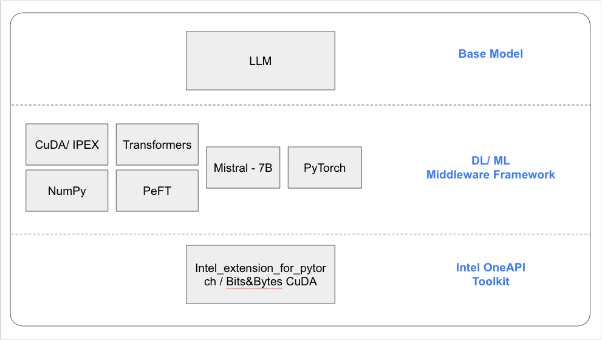

rr# oneAPI-GenAI-Hackathon-2023 - Hack2Skill

#### Team Name - Team BhuMe
#### Problem Statement - AI-Enhanced Legal Practice Platform
#### Team Leader Email - p17rajatp@iima.ac.in

### 📜 Overview
  This project is part of the Intel OneAPI Hackathon 2023, under the Generative AI Large Language Models Fine Tuned For Legal Practice Platform theme by Team BhuMe.
  We delved into a project to develop a robust LLM finetuned on Indian property registry and documentation data capable of extracting structured information from unstructured and complex property data. We simplify & speed-up the property legal due-diligence, conducted during the short period of deal-making. For the task at hand, we implemented the recent Mistral-7B model, which is an open-source large language model. Data is downloaded during runtime from publicly available government digital land records. Our work focused on creating real estate investor & broker centric product to fetch ownership data automatically for a given Village & Plot number, and produce into a simple to understand UI. Selenium can be used to automate data download from public records, and finetuned Mistral is used to extract structured information which can be neatly shown on a vector map UI. Mistral model is finetuned on downstream tasks (adapter layer) to improve accuracy and make it less verbose. 
  
  Further, training was done using Mistral on both Intel's Ipex to perform faster inference & Nvidia T4 GPU for benchmarking purposes. Finally, real time inference will be achieved using Intel_for_pytorch_extension. The inference model is hosted on Intel Developer Cloud using ngrok.
  

### 📜  A Brief of the Prototype:
  App is available on https://app.bhume.in/
  
  Brokers and real estate investors use our services to automate and simplify property ownership documentation.

  Lawyers use this tool to automatically download property registry data from government website, and then filter the property of interest based on property schedule containing khasra no., survey no., plot no. and other fields.
  
  Valuers use this tool to extract sale instances of properties near their area of interest.


### Tech Stack: 
  
   Technologies used to Build the prototype Intel® AI Analytics Toolkits, and it's libraries
   
   We use a mix of react, python, django, postgres and libraries like Selenium, scikit-learn and finetuned LLMs from OpenAI to build and run the app. Data is scrapped and stored for each request during runtime. downloaded data is filtered using document type and then fed into LLMs one by one to extract information which can help us simplify the UI.
   
### Step-by-Step Code Execution Instructions:
  This Section must contain a set of instructions required to clone and run the prototype so that it can be tested and deeply analyzed
  
  Run frontend
  ### `cd frontend`
  ### `npm install`
  ### `npm start`

  Inference model 
  ### `python Mistral_calling.py`

  Go to http://localhost:3000


### Step-by-Step Finetuning 
  Use the following commands to setup and activate the conda environment
  ```bash
  conda create -n venv python==3.8.10
  conda activate venv
  install pip install -r requirements.txt
  ```
  
  set the env variable to select Intel AMX ISA 
  ```bash
  export ONEDNN_MAX_CPU_ISA="AVX512_CORE_AMX"
  ```

  Preprocessing 
  Prepare the dataset using preprocess.py
  ```python preprocess.py```
  
  Finetuning
  run the command 
  ```python falcon-tune.py --bf16 True --use_ipex True --max_seq_length 512```
  
  Inference
  ```python falcon-tuned-inference.py --checkpoints <PATH-TO-CHECKPOINT> --max_length 200 --top_k 10```

### 🚩 Benchmarking Results:
  
  *inference time is measured in seconds
  
### Future Scope:
   Write about the scalability and futuristic aspects of the prototype developed

   Property disputes account for 70% of all civil court cases in India. Proper due-diligence before any transaction can help a person avoid legal issues. Barrier to due-diligence currently is data cleaning, processing and analyzing for each property in a short duration of time, while the deal is being negotiated.
   
   Future scope of work is:
   1. to integrate other legal documents pertaining to property ownership (depth)
   2. to expand to other states
   3. download ownership data for each district one-by-one and make it available to users

### Our Learnings:
   Write about the scalability and futuristic aspects of the prototype developed

   Property disputes account for 70% of all civil court cases in India. Proper due-diligence before any transaction can help a person avoid legal issues. Barrier to due-diligence currently is data cleaning, processing and analyzing for each property in a short duration of time, while the deal is being negotiated.
   
   Future scope of work is:
   1. to integrate other legal documents pertaining to property ownership (depth)
   2. to expand to other states
   3. download ownership data for each district one-by-one and make it available to users
