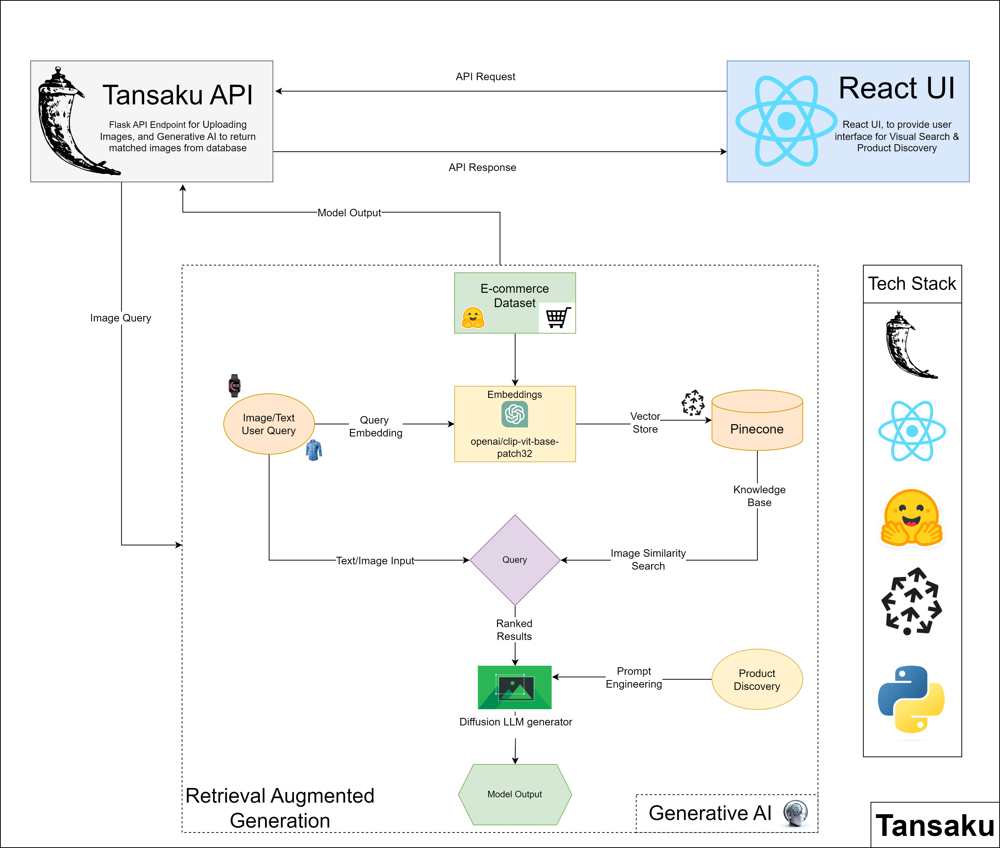
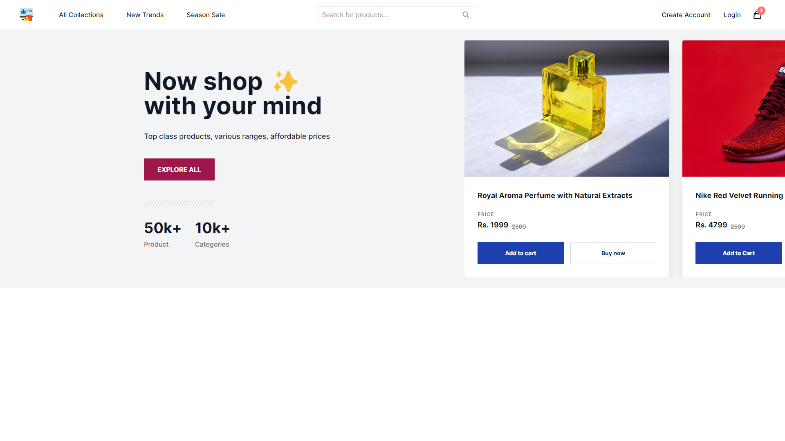
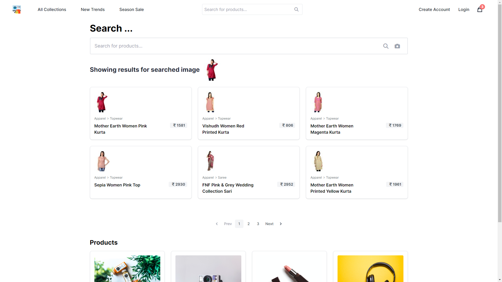
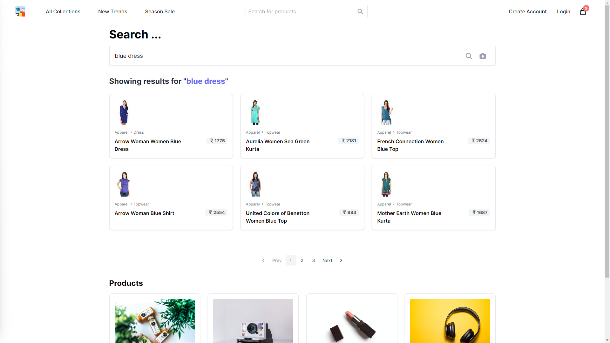
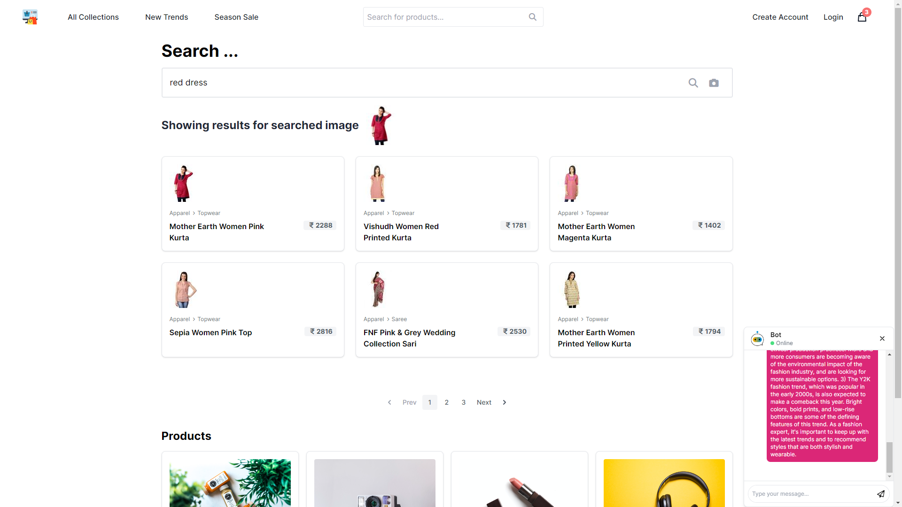

<h1 align="center">Tansaku</h1>

### PROBLEM STATEMENT

<strong>Multimodal Search and Product Discovery: </strong> 
<h6>How can we develop a generative AI system that enables multimodal search, allowing customers to find products by uploading images rather than using text-based queries? </h6>

- In the online shopping and e-commerce era, enhancing user experience and enabling efficient product discovery is critical for businesses. Text-based queries can be ambiguous, leading to results that don't match the user's intent. 
- Some queries might be complex and hard to express accurately in text, especially for intricate or specialized products. Products with specific multimodal characteristics might be challenging to describe accurately in text, leading to potentially inaccurate results.
- The challenge lies in creating a robust and effective system that can accurately understand and process user-uploaded images to retrieve relevant products from a vast catalog.

### SOLUTION

<h6> The goal of this project is to develop a generative AI system that revolutionizes the way customers interact with e-commerce platforms by introducing multimodal search capabilities leveraging state-of-the-art LLM technologies.</h6>

- This system will allow users to upload images of desired products or items, and then identify similar products from the product catalog, enhancing the user's shopping experience.
- We develop a generative AI system that enables multimodal search, allowing customers to find products by uploading images rather than using text-based queries.

### OUR APPROACH

- For visual search, we’ve encoded query images using the trained encoder and then found similarly encoded representations from our dataset. 
- OpenAI's CLIP (Contrastive Language-Image Pretraining) model is used for embedding images.
- Each of these embeddings is then saved to Pinecone Vector Database for semantic search against the query.
- For product discovery, we generate new product images using the trained generator and display them to users based on their preferences.
- Using FashinGPT and chatbot to give users fashion recommendations on asking questions.


## 1. Project Architecture

<p align="center">
  
</p> 

## 2. Getting Started With The Flask API Application

```sh
$ git clone https://github.com/jayita13/Tansaku.git
$ cd Tansaku
$ pip install -r requirements.txt
$ python app.py
```
### To run this project with docker locally
```sh
$ git clone https://github.com/jayita13/Tansaku.git
$ cd Tansaku
$ docker-compose -f docker/tansaku/docker-compose.yml up -d --build
```
Note: make sure you have secrets

## 3. Getting Started With React UI Application

```sh
$ git clone https://github.com/jayita13/Tansaku_UI.git
$ cd Tansaku_UI
$ npm i
$ npm run dev
```

## 4. Project Requirements

<h4>Languages</h4>
<ul>
  <li>JavaScript</li>
  <li>Python 3.10.5</li>
</ul>

<h4>Frameworks</h4>
<ul>
  <li>Node v18.13.0</li>
  <li>Flask v2.3.2</li>
  <li>npm v8.11.0</li>
</ul>

## 5. Application Screenshots / <a href="https://www.youtube.com/watch?v=ze_AhJvcTss">Demo.</a>

<p align="center">
  
  <hr/>
  
  <hr/>
  
  <hr/>
  
</p>


## 6. Components built 
* [x] Image to Image Search.
* [x] Text to Image Search.
* [x] Chatbot using FashinGPT Model to give user fashion recommendations.
* [ ] Product Discovery (Create new types of products based on user requirements).
* [ ] Use generative AI to extract results from multiple E-commerce databases.
* [ ] Create an Android/iOS Application.
* [ ] Deploy the Application in AWS using EKS (Elastic Kubernetes Service)
