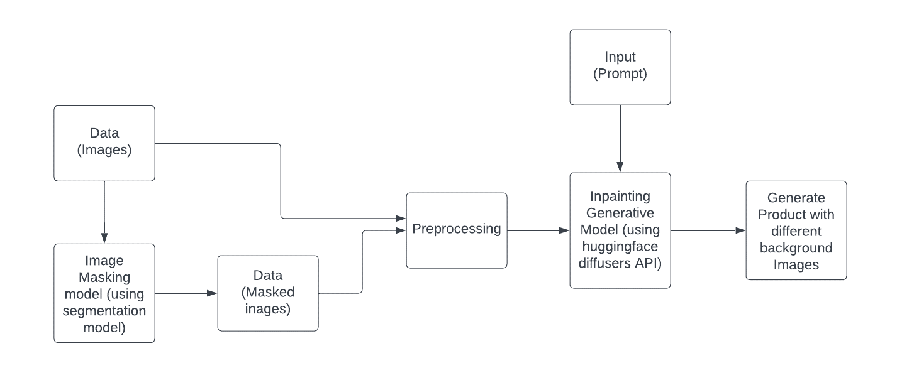

**Team Name** - Tenacious 
**Problem Statement** - Revolutionary AI-Infused Retail Platform 
**Team Leader Email** - dhiman.anushka@gmail.com 
# A Brief of the Prototype
GenAI Product Shots, will generate professional studio equivalent images of products.
GenAI Product Shots will cut the photography time, cost and resource.
We will mask the object from the image, then original image and masked image will be given as an input.
Stable diffusion will produce desirable results based on the input and prompt.
Multiple variant of these images with different colours and backgrounds can be used for product catalogue.

# Tech Stack
- Intel Extension for PyTorch
- PyTorch-GPU
- OpenCV
- Numpy
- Pillow
- YOLO
- Stable Diffusion

# Step-by-Step Code Execution Instructions

``git clone https://github.com/akkmr1996/oneAPI-GenAI-Hackathon-2023.git``

``cd Tenacious``

``pip install -r requirements.txt``

``python main.py``
 

# Future Scope
- We will develop a user friendly web application using Flask.
- In this we have only used a car as a product, but in future we will use different product like food product, beauty and fashion products.
- Then we need to train a segmentation model for these products and then deployed it on Intel Cloud and hence use the Intel OneAPI Toolkit.

